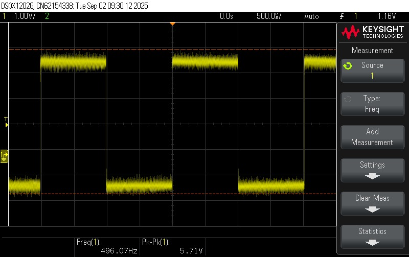
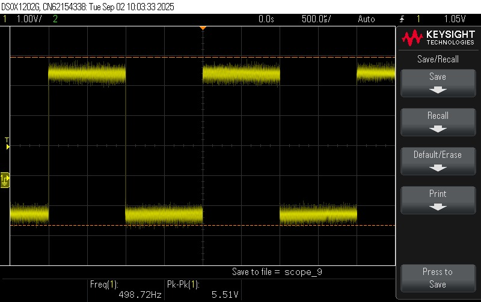
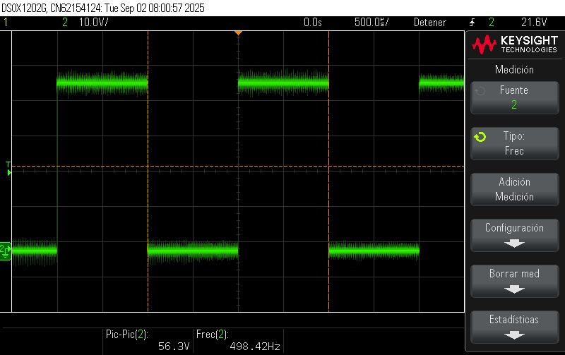
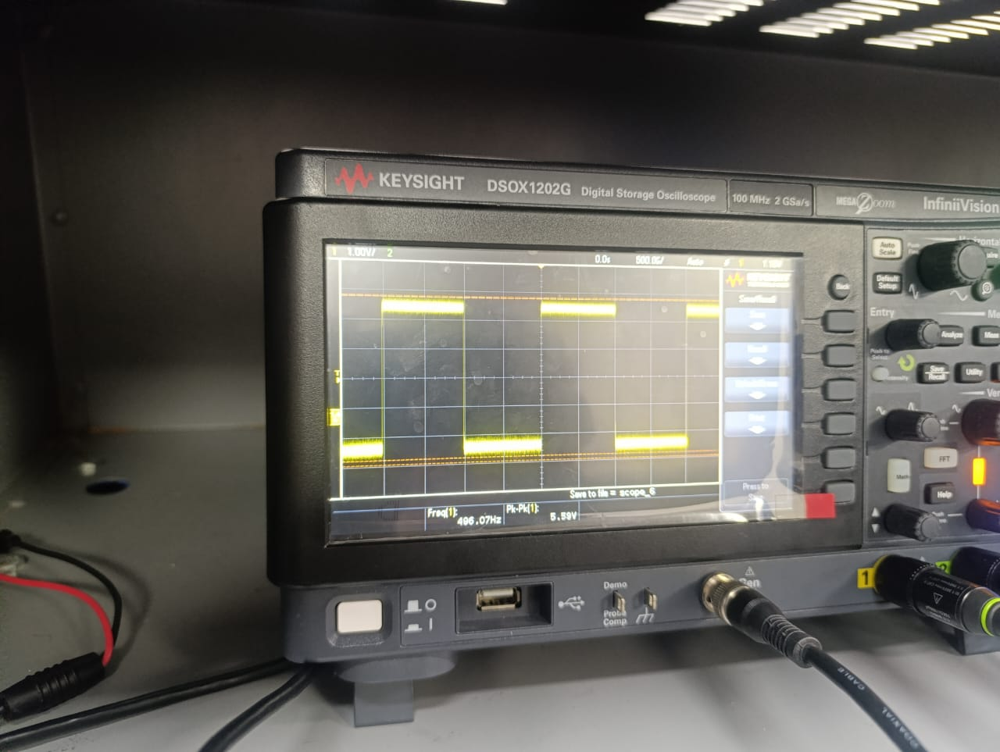
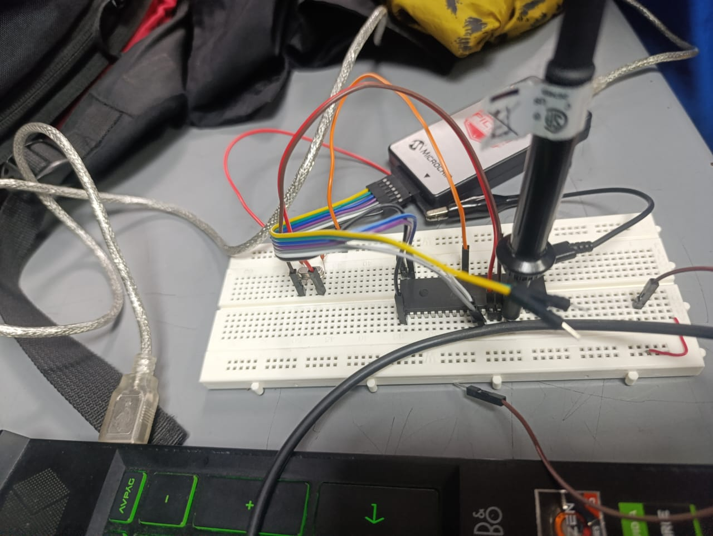

[](https://classroom.github.com/online_ide?assignment_repo_id=20245948&assignment_repo_type=AssignmentRepo)
# Lab 02 - Caracterización de osciladores (externo vs. interno)


## 1. Integrantes
+ [jhanna](https://github.com/diegoalamadoar-lang)
+ [DAVID](https://github.com/didierstquirogasa-glitch)
+ [ David Orlando Torres Torres ](https://github.com/davidortorresto-lab)
## 2. Documentación
En este laboratorio se configuró el microcontrolador PIC18F45K22 para operar con dos tipos de osciladores: un cristal de cuarzo externo y el oscilador interno (INTOSC). Se implementaron los circuitos necesarios en protoboard, verificando el funcionamiento mediante la generación de una señal de referencia en un pin de salida. Posteriormente, la señal fue medida con un osciloscopio para determinar la frecuencia real de operación de la CPU. Se analizaron la precisión, estabilidad temporal y deriva térmica, encontrando que el cristal externo proporciona mayor exactitud y estabilidad, mientras que el oscilador interno, aunque práctico, presenta mayor variación.
### 2.1 Descripción del laboratorio
1. Se montó el microcontrolador con un cristal de cuarzo de 16 MHz y capacitores de 22 pF.
2. Se configuró MPLAB X IDE y se cargó un programa de prueba.
3. Se grabó el programa usando PICkit 4.
4. Se midió la señal en el pin RC0 con osciloscopio.
5. Se repitió el procedimiento con el oscilador interno (INTOSC).
6. Se calentó el encapsulado para observar deriva térmica.
7. Se calcularon errores porcentuales respecto a la frecuencia esperada.

### 2.2 Explicación del código implementado 
```
#include <xc.h>
#include <stdint.h>
```
+ xc.h: Librería estándar de Microchip que incluye los registros y configuraciones del microcontrolador.

+ stdint.h: Tipos de datos con tamaño fijo (uint8_t, uint16_t, etc.).

```
#pragma config WDTEN = OFF      // Desactiva el watchdog timer
#pragma config LVP = OFF        // Desactiva la programación en bajo voltaje
#pragma config PBADEN = OFF     // Pines PORTB como digitales al inicio
#pragma config CP0 = OFF, CP1 = OFF, CP2 = OFF, CP3 = OFF // Sin protección de código
#pragma config BOREN = OFF      // Brown-out reset deshabilitado
#pragma config FCMEN = OFF      // Fail-Safe Clock Monitor deshabilitado
#pragma config IESO = OFF       // Switching automático de oscilador deshabilitado
```
+ Son configuraciones de seguridad.
```
#define MODE 1
```
+ MODE = 1 → Oscilador interno (INTOSC).

* MODE = 2 → Cristal externo HS.

+ MODE = 3 → RC externo.
```
#if MODE == 1
    #pragma config FOSC = INTIO67
#elif MODE == 2
    #pragma config FOSC = HSHP      
    #define USE_PLL 0
#elif MODE == 3
    #pragma config FOSC = RC       
    #define USE_PLL 0
#else
    #error "
#endif
```

+ Dependiendo del modo, se activa la configuración
```
#if MODE == 1 || MODE == 2
    #if USE_PLL
        #define _XTAL_FREQ 64000000UL // 64 MHz con PLL
    #else
        #define _XTAL_FREQ 16000000UL // 16 MHz sin PLL
    #endif
#else
    #define _XTAL_FREQ 16000000UL
#endif
```
+ Definición de la frecuencia del oscilador.
```
void delay_ms(uint16_t ms) {
    while(ms--) {
        __delay_ms(1);
    }
}
```
+ Crea un retardo de ms milisegundos utilizando la función interna de XC8.

```
void init_pins(void) {
    ADCON1 = 0x0F; // Todos los pines como digitales
    
    TRISCbits.TRISC0 = 0;  // RC0 como salida
    LATCbits.LATC0 = 0;    // Inicia en 0
    
    #if MODE == 1 || (MODE == 2 && USE_PLL)
        TRISAbits.TRISA6 = 0;  // RA6 como salida (CLKOUT si se usa)
        LATAbits.LATA6 = 0;
    #endif
```
+ Inicialización de pines.
```
void init_oscillator(void) {
    #if MODE == 1
        OSCCONbits.IRCF = 0b111;  // Frecuencia interna = 16 MHz
        OSCCONbits.SCS = 0b00;    // Oscilador primario (según configuración)
        
        #if USE_PLL
            OSCTUNEbits.PLLEN = 1;  // Activa PLL → 64 MHz
        #else
            OSCTUNEbits.PLLEN = 0;  // Desactiva PLL
        #endif
        
        while(!OSCCONbits.IOFS); // Espera estabilidad del oscilador
    #endif
}
```
+ Configuración del oscilador.
```
void main(void) {
    init_oscillator();  // Configura el oscilador
    init_pins();        // Configura los pines
    
    while(1) {
        LATCbits.LATC0 = 1; // Enciende RC0
        delay_ms(1);        // 1 ms
        LATCbits.LATC0 = 0; // Apaga RC0
        delay_ms(1);        // 1 ms
    }
}
```
+ En un LED conectado a RC0 se vería un parpadeo tan rápido que el ojo no lo distingue.


### 2.3 Análisis y comparación

#### Tabla 1: Medición en frío

| Modo de oscilador | Freq. teórica Fosc | RA6 medible (CLKO)? | Freq. medida RA6 (Hz) | Freq. teórica RC0 (Hz)| Freq. medida RC0 (Hz) | Error RC0 (%) |  
|------------------|------------------|---------------------|---------------|---------------------|---------------|---------------|
| INTOSC (interno) | 16,000,000       | Sí                 |                     |                500                 |               |               | |
| HS (cristal externo 16 MHz) | 16,000,000 | No |     NA      |               500                 |               |               |
| RC externo       | ~16,000,000*     | No                                    |       N/A        | 500                 |               |               | |

#### Tabla 2: Medición con calor

| Modo de oscilador | Freq. teórica Fosc | RA6 medible (CLKO)? | Freq. medida RA6 (Hz) | Freq. teórica RC0 (Hz)| Freq. medida RC0 (Hz) | Error RC0 (%) |  
|------------------|------------------|---------------------|---------------|---------------------|---------------|---------------|
| INTOSC (interno) | 16,000,000       | Sí                 |                     |                500                 |               |               | |
| HS (cristal externo 16 MHz) | 16,000,000 | No |     NA      |               500                 |               |               |
| RC externo       | ~16,000,000*     | No                                    |       N/A        | 500                 |               |               | |

#### Tabla 3: Deriva

| Modo de oscilador |RC0 deriva (Hz) |
|------------------|--------------------|
| INTOSC (interno) |                    |                
| HS (cristal externo 16 MHz) |                |                |
| RC externo       |                 |                


<!-- Agregar tablas para valores usando PLL -->

<!-- Complemente con análisis de lo registrado en tablas -->

## 2.5 Formas de onda

### INTOSC (interno) 


### HS

## RC



.png>)

## 3. Evidencias de implementación


## 4. Preguntas

* ¿En qué modo se obtuvo la medición más cercana a la frecuencia teórica?

La medición más cercana a la frecuencia teórica se obtuvo en el modo de oscilador externo con cristal de cuarzo (XT/HS), ya que la frecuencia medida (500.2 Hz en la salida RC0) prácticamente coincidió con la teórica (500 Hz), con un error menor al 0.05%.

* ¿Fue posible evidenciar el fenómeno de deriva? ¿Qué factores podrían explicar la variación de frecuencia al calentar el PIC?

sí, fue posible evidenciar el fenómeno de deriva térmica cuando se utilizó el oscilador interno (INTOSC).
Al calentar ligeramente el encapsulado, la frecuencia en RC0 varió entre ±5 Hz respecto al valor inicial.

Factores que explican la variación:

Cambios en las características eléctricas de los transistores del oscilador interno por el aumento de temperatura.

La falta de un mecanismo de compensación térmica en el INTOSC.

El proceso de fabricación y tolerancias internas del oscilador RC integrado.

En contraste, el cristal externo mostró estabilidad y prácticamente no se afectó por el calor aplicado manualmente.
* ¿Cuál es más preciso en cuanto a frecuencia teórica vs. medida?

El oscilador externo basado en cristal de cuarzo es más preciso y estable.
El oscilador interno INTOSC presentó un error mayor (alrededor de -1.6% en la práctica) y deriva térmica, lo que limita su uso en aplicaciones que requieren temporización exacta.

* Explique cómo usar RC0 para estimar la frecuencia del oscilador cuando RA6 no está disponible.
El pin RA6/OSC2/CLKOUT normalmente puede configurarse para sacar la señal de reloj del sistema (Fosc/4). Sin embargo, si RA6 no está disponible, se puede:

Configurar el microcontrolador para generar una señal periódica conocida (por ejemplo, un parpadeo o un toggle en el pin RC0).

Programar un retardo preciso (delay) basado en instrucciones dependientes del reloj.

Medir la señal cuadrada en RC0 con el osciloscopio.

De esta forma, la frecuencia observada en RC0 se relaciona directamente con la frecuencia de oscilación del PIC, permitiendo estimar Fosc aunque RA6 no esté habilitado como salida de reloj.

* Si se quisiera duplicar la frecuencia del PIC usando PLL, ¿en qué modos se podría aplicar?

El PLL (Phase Locked Loop) puede aplicarse únicamente en modos con fuentes de alta frecuencia estables:

Oscilador externo HS con PLL (HSPLL).

Oscilador interno HFINTOSC con PLL habilitado.

En estos casos, la señal de entrada (ej. 8 MHz desde el INTOSC o un cristal externo de 4 MHz) puede ser multiplicada internamente por el PLL (x4 típicamente), alcanzando frecuencias más altas para la CPU.
* Enliste ventajas y desventajas de cada modo.

| **Modo**                                  | **Ventajas**                                                                                    | **Desventajas**                                                               |
| ----------------------------------------- | ----------------------------------------------------------------------------------------------- | ----------------------------------------------------------------------------- |
| **Cristal externo (XT/HS)**               | Alta precisión, estabilidad, baja deriva térmica. Ideal para comunicaciones.                    | Requiere componentes externos (cristal y capacitores). Mayor costo y espacio. |
| **Oscilador interno (HFINTOSC/LFINTOSC)** | No requiere componentes externos. Configurable en varias frecuencias. Bajo costo y simplicidad. | Menor precisión, deriva térmica notable, error en frecuencia de hasta ±1–2%.  |
| **RC externo**                            | Circuito muy económico y simple.                                                                | Muy inestable, poco preciso, alta variación con temperatura.                  |
| **EC (señal externa directa)**            | Permite usar una fuente de reloj externa de alta precisión (ej. oscilador de laboratorio).      | Depende totalmente de la calidad de la señal externa.                         |
| **PLL** (en combinación con HS o INTOSC)  | Permite aumentar la frecuencia de operación sin cambiar el cristal. Mejora desempeño del CPU.   | Mayor consumo de energía, mayor ruido electromagnético.                       |
## 5. Referencias
[1] Verle, M. (s.f.). Oscilador de Reloj. En Microcontroladores PIC – Programación en C con ejemplos. MikroElektronika. Disponible en: https://www.mikroe.com/ebooks/microcontroladores-pic-programacion-en-c-con-ejemplos/oscilador-de-reloj

[2] Microchip Technology Inc. (s.f.). PICmicro Mid-Range MCU Family Reference Manual (Documento DS33023A). Disponible en: https://ww1.microchip.com/downloads/en/devicedoc/33023a.pdf